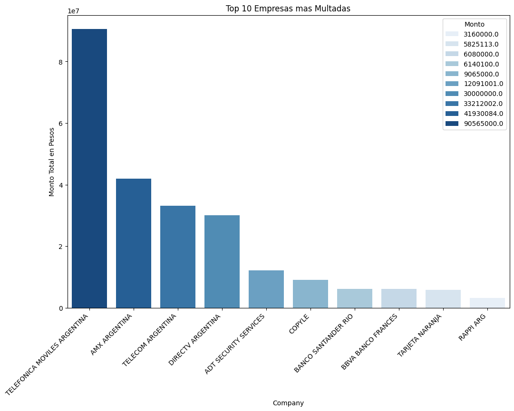
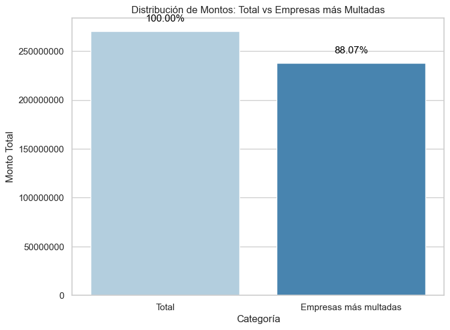
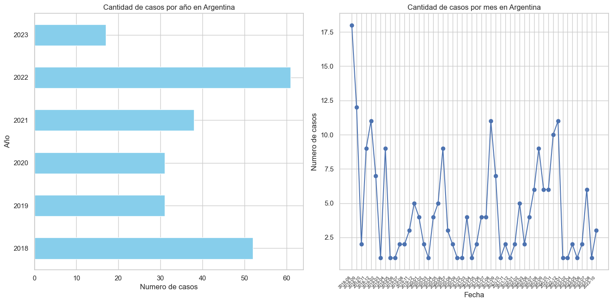

# Data Compliance

La importancia del cumplimiento normativo de datos, también conocido como data compliance, en las empresas es fundamental en el panorama actual, donde la información se ha convertido en uno de los activos más valiosos. El data compliance se refiere al conjunto de prácticas y medidas que una organización adopta para garantizar que la recopilación, almacenamiento, procesamiento y transmisión de datos cumplan con las leyes y regulaciones aplicables.

En un mundo cada vez más digitalizado, las empresas manejan grandes cantidades de información personal y confidencial de clientes, empleados y socios comerciales. El incumplimiento de las normativas de protección de datos puede tener consecuencias graves, tanto a nivel legal como reputacional. Las sanciones por violaciones a la privacidad y la seguridad de los datos pueden resultar en multas significativas y pérdida de confianza por parte de los clientes y otras partes interesadas.

El data compliance no solo se trata de cumplir con requisitos legales, sino también de construir una base sólida para la confianza del cliente. Las empresas que demuestran un compromiso serio con la protección de la información ganan la confianza de sus clientes y pueden diferenciarse positivamente en un mercado cada vez más competitivo. Además, el cumplimiento normativo contribuye a la gestión eficiente de riesgos, ya que ayuda a prevenir la pérdida de datos, el robo de identidad y otros incidentes de seguridad que podrían perjudicar la estabilidad operativa de la empresa.

# Contenido del proyecto

- **get_data.py** : Este script cumple la función de extraer información de diversas fuentes de datos. No solo se encarga de la recolección de datos, sino que también realiza procesos de transformación para estructurar la información de manera adecuada. Finalmente, almacena los datos procesados en archivos CSV y XLSX, proporcionando así una base de datos organizada y lista para su posterior análisis.

- **EDA.ipynb**: En este Notebook se realiza un examen detallado de los datos recopilados. Aquí se llevó a cabo el análisis exploratorio de datos y se formularon respuestas a preguntas mediante gráficos.

# ¿Que es el GDPR?

El Reglamento General de Protección de Datos (GDPR, por sus siglas en inglés) es una regulación de la Unión Europea que entró en vigencia el 25 de mayo de 2018. Su objetivo principal es fortalecer y unificar las normativas de protección de datos para todos los individuos dentro de la Unión Europea (UE) y del Espacio Económico Europeo (EEE).

Con el propósito de proporcionar información actualizada sobre las multas impuestas a personas físicas y jurídicas que forman parte de la Unión Europea, el GDPR ofrece un seguimiento detallado a través del sitio web **https://www.enforcementtracker.com/**. Para llevar a cabo el análisis correspondiente, se extrajo información directamente de esta plataforma web.

# Distribución de Multas en Países según el Recuento y Monto Total

En este gráfico se pueden observar los 10 países que recibieron más multas. El primer punto que destaca es que España acumula la mayor cantidad de multas, llegando casi a 800, lo que representa más del doble que su seguidor más cercano. Sin embargo, cuando se realiza una agrupación por el monto total de la multa aplicada, encontramos que Irlanda encabeza la lista, al mismo tiempo que no es uno de los países que más multas individuales ha obtenido.

Este comportamiento lo atribuimos a varios factores que se hacen evidentes al observar cuáles son los tipos de empresas que reciben multas en estos países.

---

La media de las sanciones aplicadas en España no excede los 100.000 euros y, por norma general, se imponen debido a que la empresa en cuestión no tiene las bases legales para procesar los datos que ha recogido. 

Por otra parte, en Irlanda, la tasa impositiva en el impuesto de sociedades es del 12.5%, la más baja de la Unión Europea. Esto no es un dato menor, ya que, como veremos más adelante, Irlanda es el asiento principal de las mayores empresas de redes sociales en el continente europeo, **particularmente de Meta**.

[Carga Impositiva en Irlanda](https://expansion.mx/tecnologia/2021/06/28/por-que-irlanda-es-tan-importante-para-las-tecnologicas)

[Multas en España](https://www.eleconomista.es/tecnologia/noticias/12325618/06/23/espana-sigue-siendo-el-pais-que-mas-multas-recibe-por-infracciones-del-rgpd-.html)

# Articulos en los que mas se sustentaron las sanciones

El Reglamento General de Protección de Datos (GDPR) establece principios fundamentales y medidas para garantizar la protección de datos personales. Según **el Artículo 5,** se enfatiza la legalidad, equidad y transparencia en el procesamiento, así como la limitación de la finalidad, minimización de datos, exactitud, almacenamiento limitado y la aplicación de medidas de integridad y confidencialidad.

**El Artículo 6** del GDPR detalla las bases legales para el procesamiento de datos, incluyendo el consentimiento, ejecución de contratos, cumplimiento de obligaciones legales, protección de intereses vitales, tareas de interés público y el ejercicio de poderes oficiales, así como la legitimidad de intereses perseguidos por el responsable del tratamiento.

Por otro lado, **el Artículo 32** establece medidas de seguridad que las organizaciones deben adoptar para proteger los datos personales. Esto incluye la seguridad del tratamiento, la evaluación del riesgo, la pseudonimización y cifrado, la garantía de confidencialidad, integridad, disponibilidad y resiliencia de los sistemas, la restauración eficiente de la disponibilidad de datos, así como la verificación y evaluación regulares, y la formalización por escrito de acuerdos con encargados del tratamiento. En conjunto, estos elementos buscan asegurar un procesamiento de datos seguro y conforme a los principios del GDPR.

Se observa que la mayoría de las multas se concentran en violaciones a los principios fundamentales protegidos por el GDPR, el incumplimiento de las obligaciones de las empresas al proteger los datos y las fallas al obtenerlos y procesarlos. 

Cuando analizamos las multas más cuantiosas impuestas, observamos que estas se fundamentan en varios artículos del GDPR. No obstante, llama la atención un valor atípico: la sanción más elevada tiene su base en el Artículo 46, inciso 1, del GDPR, el cual trata sobre las transferencias de datos personales a terceros países u organizaciones internacionales. A continuación, se presenta un resumen de dicho artículo:

>**Artículo 46 (1) - Transferencias sujetas a garantías adecuadas:**
>
>*Principio General:*
>Las transferencias de datos personales a terceros países u organizaciones internacionales solo son permitidas si el responsable del tratamiento o el encargado del >tratamiento ha proporcionado garantías adecuadas para la protección de datos personales.
>
>*Tipos de Garantías:*
>Las garantías adecuadas pueden lograrse mediante cláusulas contractuales tipo aprobadas por la Comisión Europea o mediante instrumentos vinculantes de corporativos. También >puede considerarse otras formas de garantías, como decisiones de adecuación adoptadas por la Comisión Europea.
>
>*Proceso de Aprobación:*
>Las cláusulas contractuales tipo y los instrumentos vinculantes de corporativos deben ser aprobados por la autoridad de control competente, en consulta con el Comité >Europeo de Protección de Datos.
>
>*Derechos Ejecutables y Recursos Jurídicos:*
>Las cláusulas contractuales tipo y los instrumentos vinculantes de corporativos deben contener disposiciones que permitan a los interesados ejercer derechos ejecutables y >tener recursos jurídicos efectivos.

En este caso, Meta fue sancionada por violar la privacidad de sus usuarios y por la presunta triangulación de información con el gobierno de los Estados Unidos.

Si comparamos el monto de esta única sanción con el resto, observamos lo desorbitante de la multa. Aunque un posible motivo de esta sanción podría ser el carácter ejemplificativo que se le atribuye, dado que estos casos prácticamente carecen de precedentes. Es posible que se esté buscando establecer jurisprudencia sobre el caso en cuestión.

[Link a nota sobre el caso](https://www.forbes.com.mx/irlanda-multa-meta-1200-millones-infringir-normativa-privacidad-datos/)

# ¿Y las otras empresas de redes sociales?

# Industrias más Sancionadas

A estas alturas, es posible vislumbrar claramente cuál es la industria más sancionada, siendo las del sector de las telecomunicaciones, medios y radiodifusión las que ocupan el primer puesto, especialmente cuando se mide la cuantía de las multas impuestas. Sin embargo, no podemos pasar por alto la relevancia de la industria que se posiciona en el segundo lugar, hecho que se torna aún más evidente al agrupar las sanciones por sector. 

Sorprendentemente, es en el tercer puesto donde encontramos a las empresas de redes sociales, un dato que resalta la creciente atención y escrutinio regulatorio sobre estas plataformas en relación con la protección de datos. Este posicionamiento demuestra la importancia de las medidas de cumplimiento normativo, como el GDPR, en un entorno donde la gestión adecuada de la información se ha convertido en un aspecto crucial para empresas de diversas índoles.

# Sanciones a travez del tiempo

En este gráfico, observamos la tendencia en la cantidad de multas a lo largo del tiempo. El Reglamento General de Protección de Datos (GDPR) entra en vigencia en el año 2018, marcando así nuestro punto de partida. Se evidencian picos cercanos a mediados del período y, en general, una tendencia ascendente. El caso emblemático de Meta ocurre en mayo de 2023. Aunque se mencionó la posibilidad de que la sentencia tuviera un carácter ejemplificativo, resulta dudoso que haya tenido un impacto directo en la disminución de casos durante el año 2023.

Aunque lo óptimo sería analizar a fondo este último año, se observa que prácticamente es el único punto desde 2019 en el que las sanciones impuestas no alcanzan a sumar las 20 mensuales en todo el continente europeo e incluso se nota una disminución de casos en este último periodo anual.

# El caso de Argentina

## ¿Que es la ley 25.326?

La Ley N.º 25.326 de Argentina, conocida como la "Ley de Protección de Datos Personales" o "Ley de Habeas Data", fue sancionada el 4 de octubre de 2000 y regula la protección integral de los datos personales asentados en archivos, registros, bancos de datos, u otros medios técnicos de tratamiento de datos, sean estos públicos o privados.

Esta legislación reconoce los derechos de los titulares de datos personales, los cuales comprenden el acceso, rectificación, actualización, inclusión o supresión de los datos cuando estos resulten incorrectos o incompletos. Asimismo, establece que los datos personales deben ser tratados con una finalidad específica y legítima, asegurando que sean adecuados, pertinentes y no excesivos en relación con la finalidad para la cual fueron recopilados, entre otras disposiciones.

Para llevar a cabo el análisis correspondiente a esta ley, se empleó información obtenida del buscador de normativa vigente de la Agencia de Acceso a la Información Pública, disponible en **https://www.argentina.gob.ar/aaip/buscador-normativa.**

## La Agencia de Acceso a la Información Pública

La Agencia de Acceso a la Información Pública (AAIP) en Argentina es un organismo encargado de promover y garantizar el derecho de acceso a la información pública en el ámbito del Poder Ejecutivo Nacional. Fue creada a través de la Ley Nacional de Acceso a la Información Pública N° 27.275, que fue promulgada en 2016.

Además, la Agencia de Acceso a la Información Pública brinda asesoramiento a los organismos del Poder Ejecutivo Nacional para asegurar que cumplan con las disposiciones de la ley en cuanto a la transparencia y el acceso a la información. También actúa como un organismo de revisión en caso de que existan reclamos o denuncias por parte de personas que consideren que se ha limitado indebidamente su derecho de acceso a la información pública.

En este momento, existen 230 expedientes que penalizan algunos de los principios y directrices establecidos por esta ley. De estos, solo 5 cuentan con una sentencia firme, mientras que los 225 restantes están en proceso de revisión por la autoridad competente. Por esta razón, he decidido anonimizar el nombre de las empresas, asignándoles únicamente un número identificativo.

Considero que esta medida es crucial, ya que, aunque el principio de "presunción de inocencia" es un derecho constitucional que se aplica a las personas físicas en el ámbito del derecho penal (estableciendo que todos son inocentes hasta que se demuestre lo contrario), no contar con una sentencia firme y tener aún en revisión los casos individuales hace injusto hacer públicos los nombres de las empresas. A pesar de que los datos que utilicé son de acceso público, estas empresas son utilizadas por muchos de nosotros como usuarios, y nombrarlas públicamente en este momento podría resultar injusto.

# ¿Cuales son la empresas mas multadas?

En estos gráficos, observamos el monto que representan las multas aplicadas a las empresas más sancionadas por la ley. Del total de **$270.308.680,** se concentran **$234.983.300** solo en las 10 empresas más multadas. Esto equivale a casi el 85% del total de multas, las cuales son asumidas únicamente por estas 10 empresas. Aunque los datos están anonimizados, es importante señalar que en este ranking se incluyen solo tres tipos de empresas.

- Empresas de telecomunicaciones y proveedoras de servicios de conectividad

- Entidades Bancarias

- Entidades Financieras

## ¿A que se debe esto?

La Agencia de Acceso a la Información Pública (AAIP) establece dos tipos diferentes de multas para casos específicos, distinguiendo entre **infracciones graves e infracciones leves.** La diferencia clave entre ambas radica en que las infracciones leves se refieren a violaciones enumeradas en la Ley 26.951, conocida como la ley "No Llame". Estas infracciones son de menor cuantía. En contraste, las infracciones graves van en contra del espíritu de la Ley de Protección de Datos Personales y son las más costosas, llegando a alcanzar hasta $3.000.000 (en moneda argentina).

Esta distinción cobra relevancia y ayuda a entender por qué ciertas empresas son más frecuentemente sancionadas por la AAIP. En muchos de estos casos, los expedientes compartían una similitud: la mayoría de las empresas fueron inicialmente sancionadas por violar la ley "No Llame". Esto ocurría cuando los usuarios tenían deudas con las empresas. Además, estas compañías utilizaban empresas tercerizadas para llevar a cabo las llamadas rutinarias, en las cuales la empresa principal cedía los datos personales de los usuarios para contactarlos, constituyendose la infracción grave.

# Cantidad de Multas a Través del Tiempo

